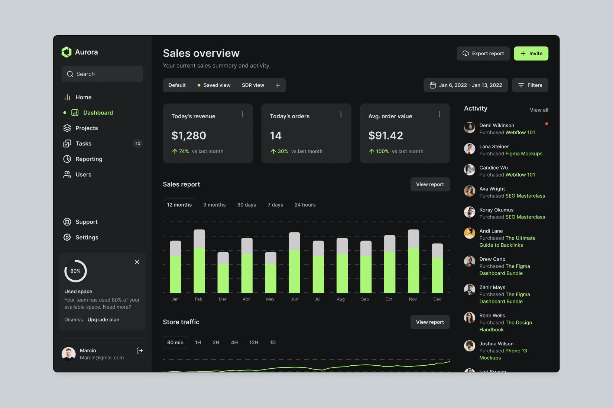

# Dashboard - Greendash

## Description

Greendash is a web app designed to present a variety of fictional data in an intuitive and interactive format.

Initially focused on front-end development, this project aims to replicate a compelling dashboard design based on an inspirational picture found online (see it below).

## Tech stack
 

## Table of Contents
- [Installation](#installation)
- [Usage](#usage)
- [Features](#features)
- [Further Improvements](#improvement)
- [Contact](#contact)
- [Acknowledgments](#acknowledgments)

## Installation
Follow these steps to set up the Greendash project on your local machine.

### Prerequisites
Before you begin, ensure you have the following installed:

- Node.js (v14.x or higher)
- npm (v6.x or higher)

### Installation Steps
1. Clone the repository

    Clone the repository to your local machine using Git.

    `git clone https://github.com/mcoldibelli/greendash.git`

2. Navigate to the Project directory

    `cd greendash`

3. Install dependecies

    Install the required npm packages.

    `npm install`

4. Run the development Server

    Start the development server to view the project locally.

    `npm run dev`

    The application should now be running at http://localhost:3000.

## Usage
🚧 Under development 🚧

## Features
- Side Menu
- Dinamic charts
- Filters
- Sale history

## Improvement
Future iterations will integrate backend functionalities, enabling dynamic data handling and enhanced interactivity.

## Contact
Reach me on [marcelo.coldibelli@gmail.com](marcelo.coldibelli@gmail.com)

## Acknowledgments
- Design Image: Credits all for it's creator.
